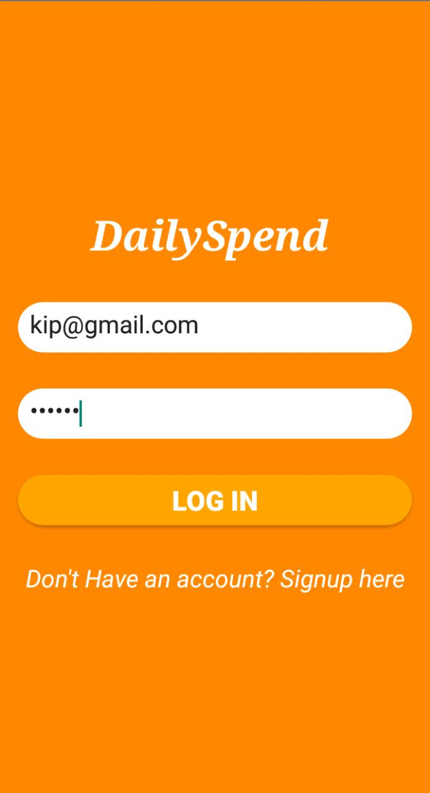
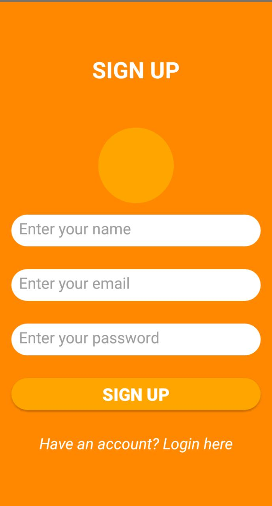
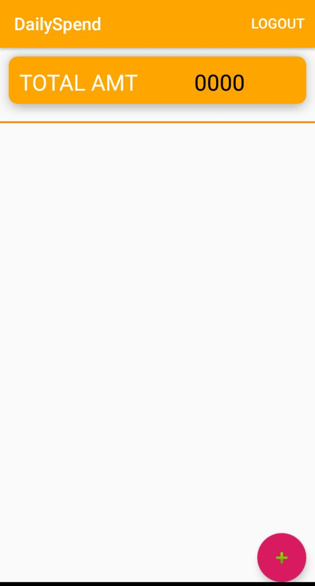
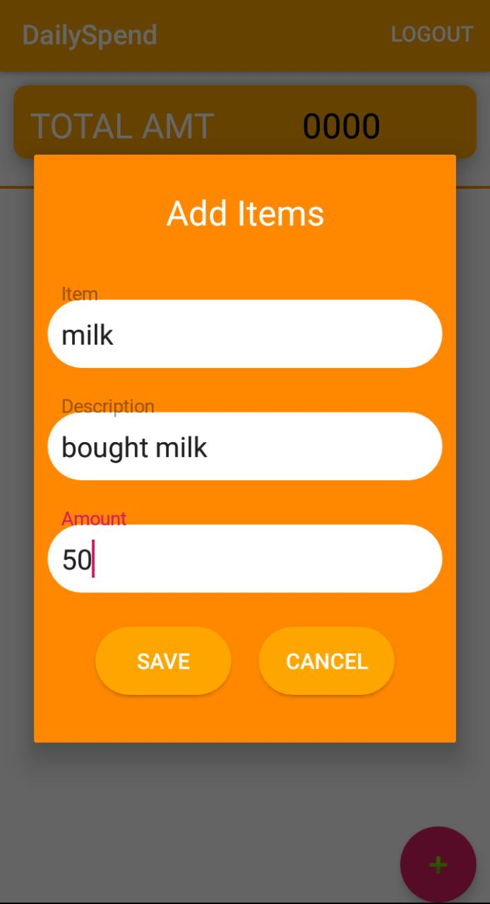
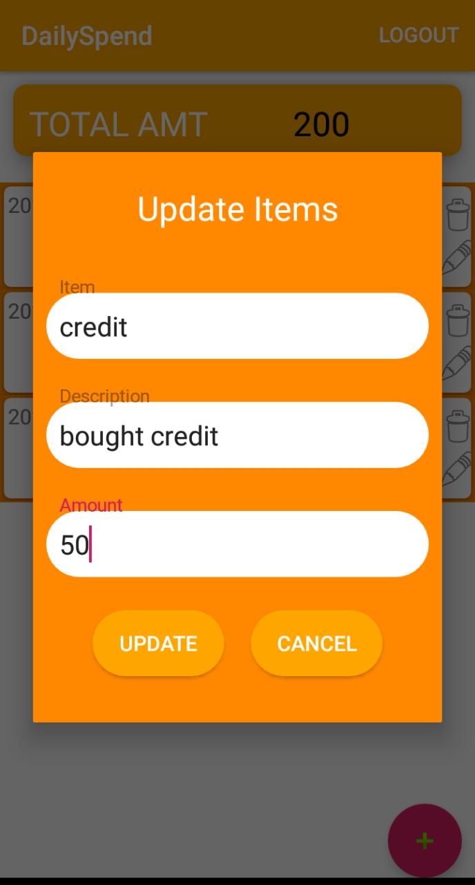
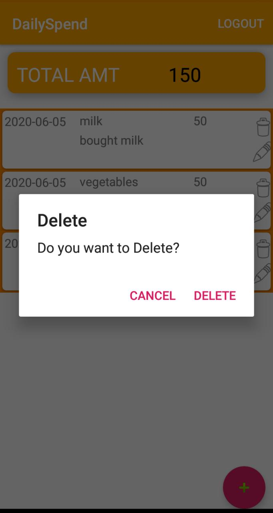

# DailySpend
This is an Android application that keeps track of daily expense

<b>Login Page</b>
 

This is the login page of the DailySpend

 
 
<b>Signup Page</b>
 

This is the signup page of the DailySpend

 

 
<b>Home Page</b>
 

When the registered user logs in for the first time, this is the home page without any item.

 

 
<b>Adding Items</b>
 

This is where a user is able to add items.

 

 
<b>Updating Items</b>
 

This is where a user is able to edit items.

 

 
<b>Deleting Items</b>
 

This is where a user is able to delete selected item.

 

